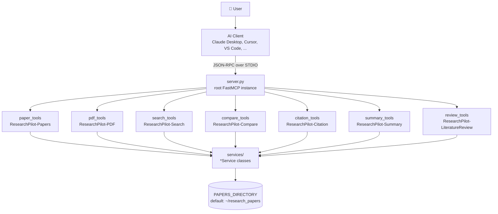

<div align="center">

# 🚀 ResearchPilot-MCP

**Give your AI agent hands to work with your local research library.**

An [MCP](https://github.com/Model-Context-Protocol) server that lets AI clients — Claude Desktop, Cursor, VS Code, and others — list, read, search, summarize, compare, and cite local PDF research papers, and synthesize literature reviews, without ever loading a whole paper into the model's context.

[](https://www.python.org/downloads/)
[](./LICENSE)
[](https://github.com/Model-Context-Protocol)
[](https://github.com/jlowin/fastmcp)

</div>

---

## Why ResearchPilot-MCP?

Reading through a stack of PDFs to answer one question is slow, and dumping entire papers into an LLM's context window is wasteful and expensive. ResearchPilot-MCP sits between your AI client and your papers folder, exposing 15 focused tools that return exactly what's needed — a page range, a keyword hit, an abstract, a formatted citation — so your agent stays fast, cheap, and grounded in the actual source text.

## ✨ Features

- 📄 **Paper discovery** — scan a directory and surface title, page count, and file size for every PDF
- 📖 **Targeted PDF reading** — pull specific page ranges or a single page instead of the whole document
- 🧾 **Abstract extraction** — pull just the abstract from the first page
- 🔎 **Keyword search** — single or multi-keyword search across the whole library, with snippets and per-paper counts
- 📊 **Summarization** — generate paper summaries, quick overviews, and extracted key findings
- 🤝 **Comparison** — compare papers side by side and find similar papers via keyword overlap
- 📚 **Citations** — generate IEEE, APA, and BibTeX entries
- 📑 **Literature reviews** — auto-build a structured markdown review around a topic, pulling in summaries and common themes across matching papers
- ⚡ **MCP-native** — built on [FastMCP](https://github.com/jlowin/fastmcp), speaks JSON-RPC over stdio, works with any MCP-compatible client

## 🏗️ Architecture

`server.py` creates a root `FastMCP` instance and **mounts** seven sub-servers, one per tool module. Each tool is a thin `@mcp.tool()` wrapper that instantiates a service (scoped to `PAPERS_DIRECTORY`) and delegates the actual work to it.



Each of the seven modules under `src/tools/` creates its own `FastMCP` instance and `mcp.mount()`s it onto the root server in `server.py` — so the tools stay organized by domain while presenting as one unified server to the client.

## 📁 Project Structure

```
ResearchPilot-MCP/
│
├── src/
│   ├── __init__.py
│   ├── config.py                 # PAPERS_DIRECTORY, MAX_PAPERS_PER_LIST, PDF_EXTRACT_LENGTH
│   ├── server.py                 # Root FastMCP instance; mounts all tool modules
│   │
│   ├── tools/                    # @mcp.tool()-decorated MCP entry points
│   │   ├── __init__.py
│   │   ├── paper_tools.py        # list_papers
│   │   ├── pdf_tools.py          # read_pdf, extract_abstract, get_page
│   │   ├── search_tools.py       # search_keyword, search_multiple_keywords, count_keyword_occurrences
│   │   ├── compare_tools.py      # compare_papers, find_similar_papers
│   │   ├── citation_tools.py     # generate_ieee_citation, generate_apa_citation, generate_bibtex
│   │   ├── summary_tools.py      # summarize_paper, get_paper_overview, extract_key_findings
│   │   └── review_tools.py       # build_literature_review, get_papers_by_keyword
│   │
│   └── services/                 # Framework-agnostic business logic
│       ├── paper_service.py      # PaperService, PaperInfo
│       ├── pdf_service.py        # PDFService
│       ├── search_service.py     # SearchService
│       ├── compare_service.py    # CompareService
│       ├── citation_service.py   # CitationService
│       └── summary_service.py    # SummaryService
│
├── tests/                        # PyTest suite
├── pyproject.toml                # Package metadata, deps, ruff/mypy config
├── requirements.txt               # fastmcp, pymupdf + dev deps
├── LICENSE                       # MIT
└── README.md
```

> Every tool module follows the same pattern: a private `_create_service()` builds the relevant `*Service(PAPERS_DIRECTORY)`, and the tool function just formats the service's return value for MCP.

## 🔧 Installation

### Prerequisites

| Requirement | Version |
|---|---|
| Python | 3.10+ |
| pip | any recent version |

### Install

```bash
git clone https://github.com/yourusername/ResearchPilot-MCP.git
cd ResearchPilot-MCP

# Editable install (recommended — uses pyproject.toml)
pip install -e .

# ...or install runtime + dev dependencies directly
pip install -r requirements.txt
```

For linting/type-checking/tests, install the `dev` extra:

```bash
pip install -e ".[dev]"
```

**Core dependencies** (from `pyproject.toml` / `requirements.txt`):

| Package | Purpose |
|---|---|
| `fastmcp` | MCP server framework |
| `pymupdf` | PDF text extraction |
| `pytest`, `pytest-asyncio` | Testing (dev) |
| `ruff` | Linting & formatting (dev) |
| `mypy` | Static type checking (dev) |

### Add your papers

By default the server reads from `~/research_papers` (`src/config.py`):

```bash
mkdir -p ~/research_papers            # macOS / Linux
New-Item -ItemType Directory -Path "$HOME\research_papers"   # Windows PowerShell
```

Drop your PDFs in there, or point `PAPERS_DIRECTORY` in `src/config.py` at a different folder.

## ▶️ Running the Server

```bash
python -m src.server
```

This creates the root `FastMCP("ResearchPilot-MCP")` instance, mounts all seven tool modules, and calls `mcp.run()`, which serves over **stdio** — reading JSON-RPC requests from `stdin` and writing responses to `stdout`. Stop it with **Ctrl+C**.

## 🔌 Connecting to AI Clients

### Claude Desktop

Add to `claude_desktop_config.json`:

```json
{
  "mcpServers": {
    "researchpilot": {
      "command": "python",
      "args": ["-m", "src.server"],
      "cwd": "/absolute/path/to/ResearchPilot-MCP"
    }
  }
}
```

Restart Claude Desktop, then ask something like:

> "List my available papers and summarize the most recent one."

### Cursor IDE

**Settings → Extensions → MCP** → add a server:

```json
{
  "name": "researchpilot",
  "command": "python",
  "args": ["-m", "src.server"],
  "cwd": "/absolute/path/to/ResearchPilot-MCP"
}
```

### Any other MCP-compatible client

All MCP clients speak JSON-RPC over stdio the same way: run `python -m src.server` and point the client config at that same command and working directory.

## 🧰 Available Tools

### Paper Management

| Tool | Signature | Description |
|---|---|---|
| `list_papers` | `()` | Scans `PAPERS_DIRECTORY` and returns filename, filepath, title, page count, and size (KB) for every PDF |
| `read_pdf` | `(filename, start_page=0, max_pages=10)` | Extracts text from a page range |
| `extract_abstract` | `(filename)` | Finds and returns the abstract from the first page, if present |
| `get_page` | `(filename, page_number)` | Returns text from a single 1-indexed page |

### Search

| Tool | Signature | Description |
|---|---|---|
| `search_keyword` | `(keyword, case_sensitive=False)` | Searches all papers for a keyword, returning match snippets |
| `search_multiple_keywords` | `(keywords, match_all=False)` | Searches for several keywords at once; `match_all=True` requires every keyword present |
| `count_keyword_occurrences` | `(keyword)` | Returns total and per-paper occurrence counts for a keyword |

### Analysis

| Tool | Signature | Description |
|---|---|---|
| `summarize_paper` | `(filename, max_length=500)` | Generates a summary from abstract/intro/conclusion sections |
| `get_paper_overview` | `(filename)` | Returns metadata plus the first paragraph, without a full summary |
| `extract_key_findings` | `(filename)` | Pulls sentences matching research-finding patterns (e.g. "we find that", "our results show") |
| `compare_papers` | `(filenames)` | Compares metadata and keyword overlap across a list of papers |
| `find_similar_papers` | `(filename, max_results=5)` | Ranks other papers by keyword-overlap similarity to a reference paper |

### Citations

| Tool | Signature | Description |
|---|---|---|
| `generate_ieee_citation` | `(filename, authors=None)` | IEEE-style: `Authors. "Title". Journal, Year.` |
| `generate_apa_citation` | `(filename, authors=None)` | APA-style: `Author (Year). Title.` |
| `generate_bibtex` | `(filename, authors=None)` | BibTeX entry with generated cite key |

### Literature Review

| Tool | Signature | Description |
|---|---|---|
| `build_literature_review` | `(topic, max_papers=10)` | Matches papers by topic (title/filename), summarizes each, and assembles a structured markdown review with a comparative-themes section |
| `get_papers_by_keyword` | `(keyword)` | Returns papers whose title or filename matches a keyword |

## 🧪 Development

```bash
# Run tests
pytest tests/ -v

# Format
ruff format src/

# Lint
ruff check src/

# Type-check
mypy src/
```

## ⚙️ How a Request Flows

1. The AI agent decides it needs paper data and sends a `tools/call` JSON-RPC request over stdio.
2. `server.py`'s root MCP instance routes it to the matching mounted sub-server (e.g. `search_tools`'s `ResearchPilot-Search`).
3. The tool function's `_create_service()` instantiates the relevant service, scoped to `PAPERS_DIRECTORY`.
4. The service reads/parses the PDF(s) with PyMuPDF and returns structured data.
5. FastMCP serializes the result back to the client as JSON.

**Example — `list_papers()`:**

```json
// Request
{
  "jsonrpc": "2.0",
  "method": "tools/call",
  "params": { "name": "list_papers", "arguments": {} }
}
```

```json
// Response
{
  "jsonrpc": "2.0",
  "result": {
    "content": [
      {
        "filename": "attention_is_all_you_need.pdf",
        "filepath": "/home/user/research_papers/attention_is_all_you_need.pdf",
        "title": "Attention Is All You Need",
        "page_count": 15,
        "file_size_kb": 245.32
      }
    ]
  }
}
```

## 🗺️ Roadmap

- [x] Release v0.1.0 — core tool set (papers, search, summary, compare, citations, literature review)
- [ ] SQLite metadata store for faster indexing
- [ ] FAISS / Chroma integration for real semantic similarity (beyond keyword overlap)
- [ ] Optional OpenAI / Ollama-backed summarization
- [ ] Docker image for one-click deployment

## 🤝 Contributing

Issues and pull requests are welcome. Please run `ruff check`, `ruff format`, and `pytest` before submitting.

## 📄 License

MIT — see [`LICENSE`](./LICENSE).
